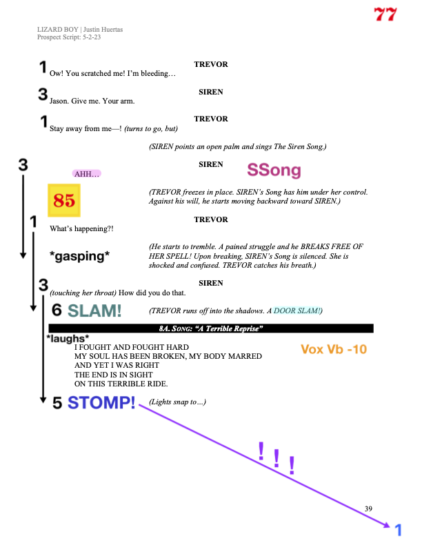

# A1 - Reference Notes

## Marking a Script for Mixing
*A short list of suggestions for useful info to put in a script, and where that info could be written on the page*
* Top Right Corner: console scene/cue number
* To the Left of Dialogue: DCA numbers and fader levels
* Bottom of the Page: the DCA number of the first line on the following page

*special thanks to Matt Karnatz*

## Console Layouts

### Assassins
* QL5 - Jacob Montgomery setup his custom fader layers as follows:
	* layer 1: band inputs with last bank of 8 being DCAs
	* layer 2: RF inputs with last bank of 8 being DCAs
* this lets him pop between band and actors while keeping his DCAs floating on top the whole time
	* if a third layer is available, maybe add one for QLab?
