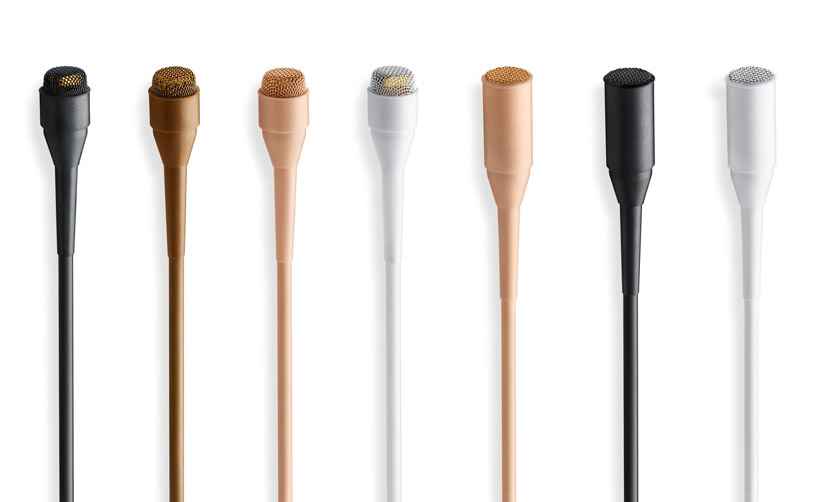
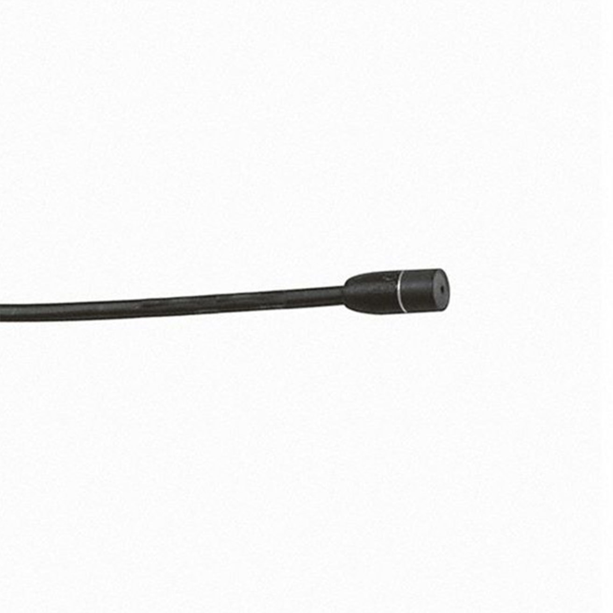

# A2 - Reference Notes
*this page is very much a work in  progress!*

## Mic Elements
*pictures of various mic elements*

**DPA 4061**

*left: soft boost, right: high-boost*

**DPA 4661**

*top 2 are normal spl, bottom his loud spl*

**DPA 6061**

**Sennheiser MKE 2**

**Sennheiser MKE 1**

**Point Source CO-8WL**

## A2 Tools and Perishables
*here's a list of tools and perishables that are handy to have in an A2 kit. links to examples of a lot of these items can be found on [the perishables](https://soundreferencenotes.com/ref_perishables.html) page*

### Tools
* hellerman tool
* needle nose pliers
* round nose jewlers pliers
* diagonal cutters, end nips, snips
* table mounted vice
* hot glue gun
* heat gun
* handheld electric fan
* knife
* surgical scissors
* whip finisher
* small paint prushes
* tool pouch
* fanny pack or apron

### Perishables
* compressed air
* alcohol swaps
* smith and nephew skin prep
	* swabs are good for actors to use themselves, spray is good for A2's to use on actors
* q-tips
* cotton balls
* latex tubing
* hellerman sleeves
* aluminum wire (2mm)
* music or piano wire (0.26")
* fly fishing line (4x)
* super glue
* hot glue
* 3M micropore
* 3M transpore
* tegaderm roll
* copic markers (skin and hair tones)
* nail polishes (skin and hair tones)
* leather shoe paints (skin and hair tones)
* matte finish clear coat nail polish
* nail polish remover
* ziplock bags
	* quart and gallon size
* paper towels
* sand paper
* elastic beading cord
* toupee clips

## A2 Paperwork
*anyone have any especially handy A2 paperwork they'd like to share?*
