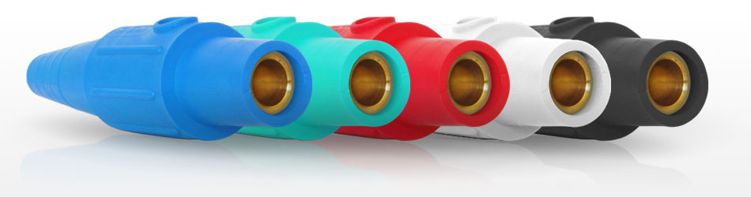
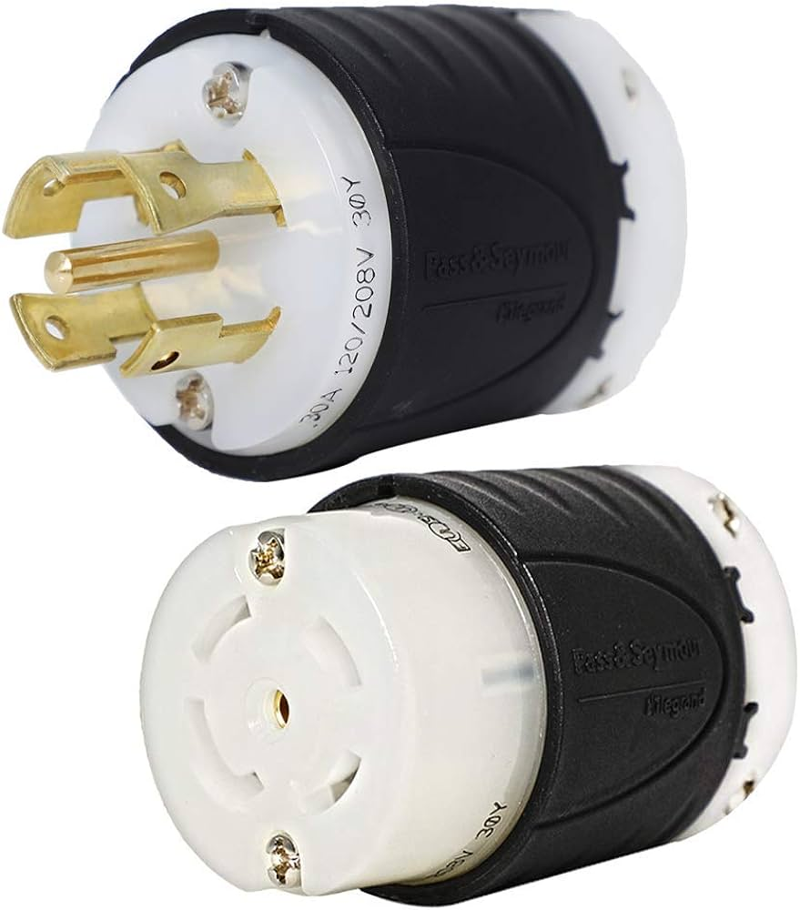
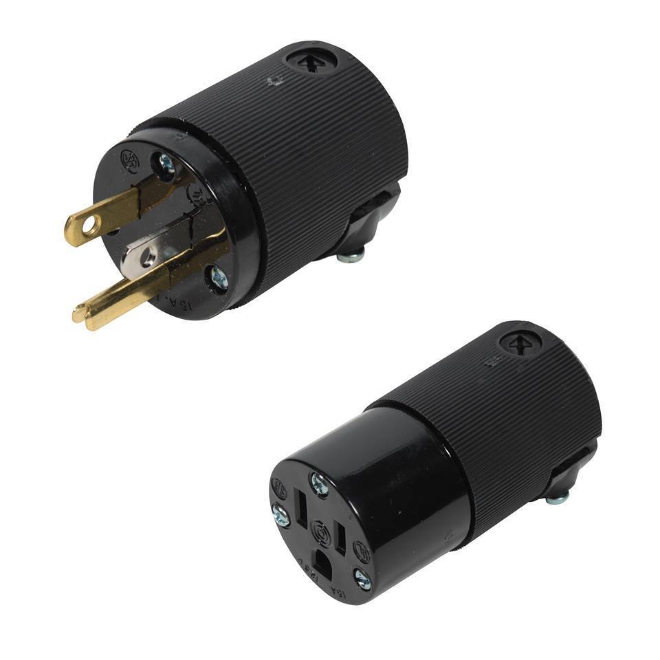
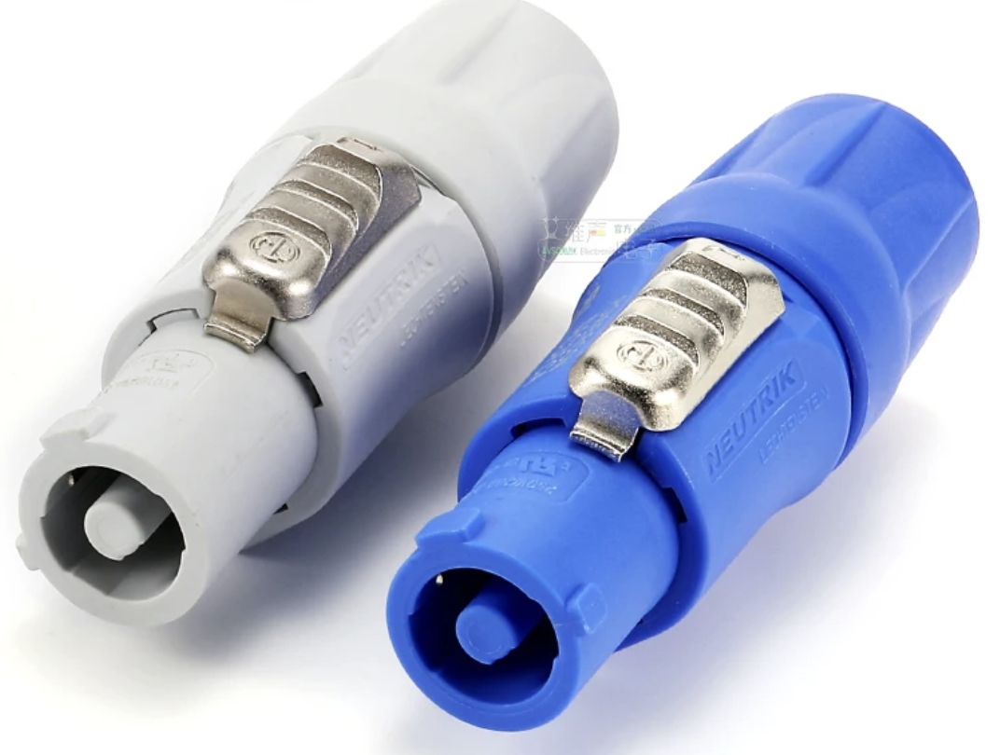
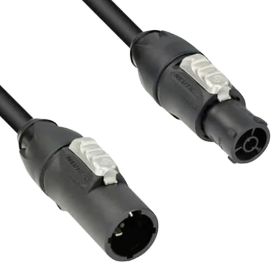

# Power - Reference Notes
*a note about electricity: it's dangerous! treat it with respect and a healthy dose of caution. When in doubt, consult an expert. these notes are not a substitution for proper training*

## Hooking up an ISO Transformer
1. confirm the company switch you're tieing into is turned off
	* use a multimeter to confirm 0v on all 3 phases
2. connect the ISO to the company switch using feeder cable, except for the neutral leg. Leave the neutral leg unplugged at both ends.
3. connect the PD to the ISO using all 5 legs of a second feeder cable

## Connectors and Electricity
### Cams/Service Tie-Ins

</img>
* 120/208v 3-phase(in the US)
	* 120v from any phase to Neutral.
 	* 208v from phase to phase.

### L21-30
</img>
* 3-phase 30A per phase.
* center pin is ground, blade w/ right angle is neutral
* 3-phases are 120v and 2 legs can be combined at the end device to make 208v.
* Often used with breakered distribution boxes at the endpoint to "break out" a single L21-30 to multiple circuits(15A, 20A, 30A) and voltages(120/208).
* Male and Female connectors.

### Edison
</img>
* 120v
* 15A or 20A
* On 20A Male connectors the Neutral blade is rotated 90 degrees to prevent plugging a 20A device into a 15A receptacle.
* Male and Female connectors.

### PowerCon
</img>
* Can carry up to 20A at 120V or 208V.
* Blue connector used for input and White connector for output.
* Requires a coupler to extend.

## TrueOne
</img>
* Can carry up to 20A at 120V or 208V.
* TOP series connectors are available and carry an IP rating when mated.
* Male and Female connectors.

## ISO Transformer Tie In
ISO creates the neutral for the PD (the load)
### Into the ISO:
* GND
* Red
* Blue
* Black

### Out of the ISO:
* GND
* Neutral
* Red
* Blue
* Black
