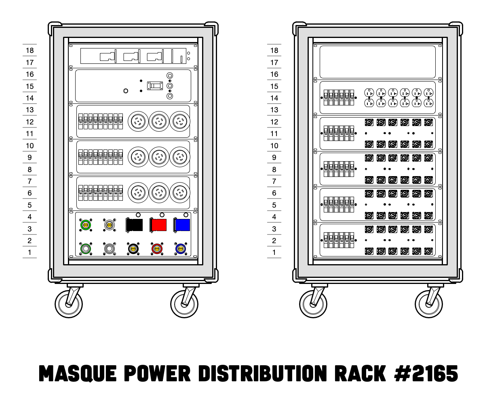
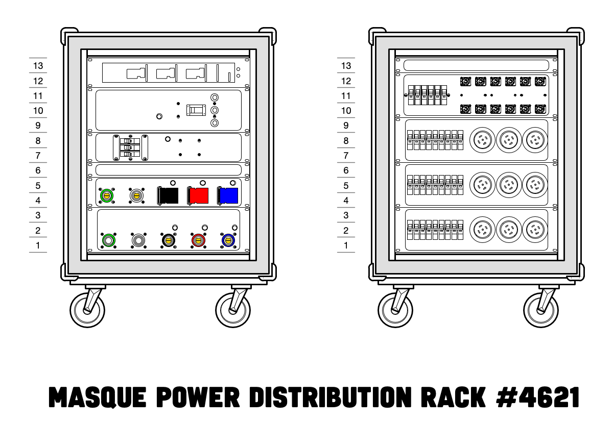
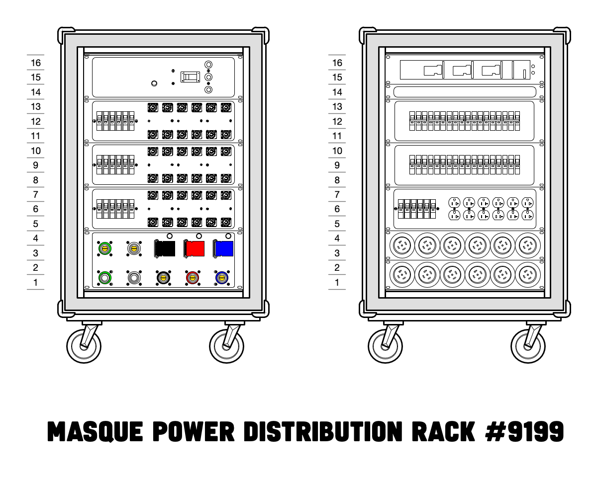

# Power Distribution
The power distribution rack is the rack which connects directly to the company switch or other top-level source of power for the sound system.

Power distribution racks come in a wide variety of configurations... some might say too wide.

## Masque Sound

### #2165 - 18U

**Line side**
 - Power meter
 - 200A main breaker
 - 9x L21-30 outlets
 - Cam-Lok in and through (three hot phases, neutral, ground)

**Load side**
 - 6x 20A Edison duplex outlets (two per circuit)
 - 24x 20A PowerCon duplex outlets (two per circuit)

### #4621 - 13U

**Line side**
 - Power meter
 - 200A main breaker
 - Three-pole secondary main breaker (??)
 - Cam-Lok in and through (three hot phases, neutral, ground)

**Load side**
 - 24x 20A PowerCon duplex outlets (two per circuit)
 - 9x L21-30 outlets

### #9199 - 16U

**Line side**
 - 200A main breaker
 - 18x 20A PowerCon duplex outlets (two per circuit)
 - Cam-Lok in and through (three hot phases, neutral, ground)

**Load side**
 - Power meter
 - 12x L21-30 outlets
 - 6x 20A Edison duplex outlets (two per circuit)
