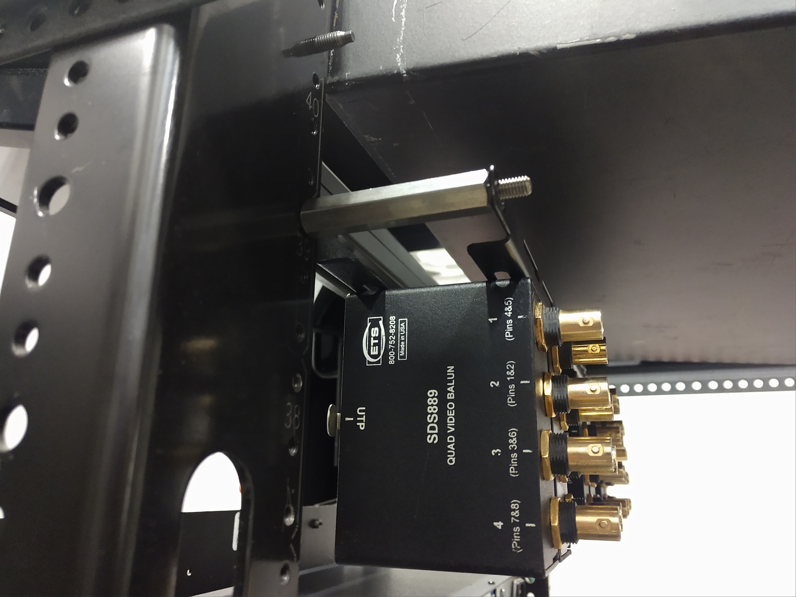

# Rack Hacks - Reference Notes

## Things to Remember
* 19pr steks don't fit next to each other in middle Atlantic 2U frames
* 19pr steks may not fit next to 12pr steks either, please confirm

## Things in RU
* Freespeak Chargers: 4RU
* Tie line on a Lacer Bar: xRU

## ETS SDS 889 Rack Mounting
Using two [Middle Atlantic L-shaped lacer bars](https://tinyurl.com/2h8sjpt6), and a few [2" stand offs](https://tinyurl.com/yj7ecfnj) you can fit up to 10 SDS889 video baluns in a 2.3U space

