# Rios - Reference Notes

## Error Messages
*If these errors have occured, the device will not operate*
|SYSTEM Indicators|Description                                                                  |Possible Solution                                            |
|-----------------|-----------------------------------------------------------------------------|-------------------------------------------------------------|
|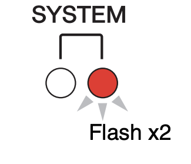          |An internal error has occurred                                               |The device has failed. Contact your Yamaha dealer for repair.|
|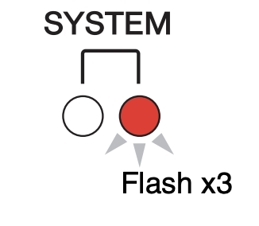          |Communication cannot occur because the MAC address setting has been corrupted|The device has failed. Contact your Yamaha dealer for repair.|
|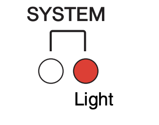          |Unit ID is not unique                                                        |Set a unique Unit ID number within the Dante network         |
|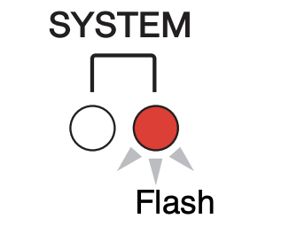          |The device's DIP switches are not set correctly                              |Check the DIP switch settings, and set them correctly        |

*These errors affect the settings or the hardware. However, the device will still be usable*
|SYSTEM Indicators|Description                                                                                                                                                                                                                             |Possible Solution                                                                                                                                                                      |
|-----------------|----------------------------------------------------------------------------------------------------------------------------------------------------------------------------------------------------------------------------------------|---------------------------------------------------------------------------------------------------------------------------------------------------------------------------------------|
|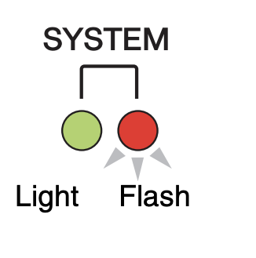            |The number of Dante flows exceed the limit                                                                                                                                                                                              |Reduce the number of flows by using Dante Controller to change some of the transmit flows to multicast                                                                                 |
|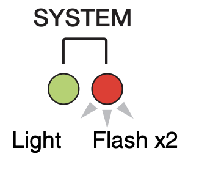            |The cooling fan has stopped                                                                                                                                                                                                             |Check that nothing is caught in the fan. If the problem persists, consult your Yamaha dealer.                                                                                          |
|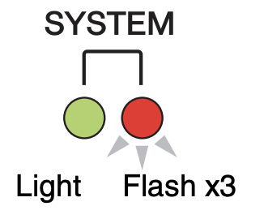            |The internal memory has been corrupted                                                                                                                                                                                                  |When using the unit in [NORMAL] mode, if the problem persists even after turning the power off and on again, consult your Yamaha dealer                                                |
|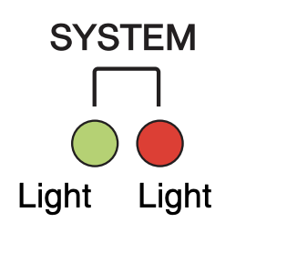            |You changed the positions of the device settings DOP switches or rotary switch, or changed the Dante settings from Dante Controller. Therefore, the positions of the device settings DIP switches do not match the actual Dante settings|If the Device Lock setting was enabled from Dante Controller, disable the setting, or check the device setting DIP switch positions, and set them to accommodate the current situation.|

## Warning Messages
*If the green SYNC indicator is unlit, the unit's clock is unconfirmed*
|SYSTEM Indicators|Description                                                                              |Possible Solution                                                                                    |
|-----------------|-----------------------------------------------------------------------------------------|-----------------------------------------------------------------------------------------------------|
|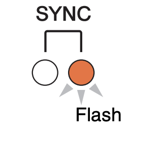        |The word clock is not set correctly                                                      |Set the clock leader and sampling frequency correctly on the Rio-native device or in Dante Controller|
|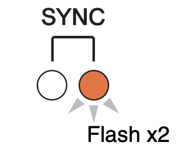        |Dante Network circuit is broken                                                          |Make sure that the Ethernet cables are not removed or short-circuited                                |
|        |Other Dante-compatible devices cannot be. Found due to an incorrectly-wired Dante Network|Make sure that the Ethernet cables are connected correctly                                           |

*If the green indicator is flashing, the unit is the clock leader. If the green indicator is lit, the unit is the clock follower and the clock is synchronized*
|SYSTEM Indicators|Description                                                                                                       |Possible Solution                                              |
|-----------------|------------------------------------------------------------------------------------------------------------------|---------------------------------------------------------------|
|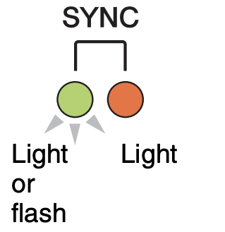        |A non-GbE-compatible device is connected                                                                          |When transferring audio via Dante, use device that supports GbE|
|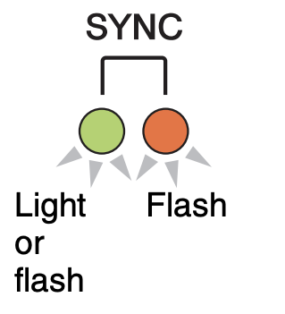        |The SECONDARY connector has taken over communications during redundant network operation                          |Check the circuit connected to PRIMARY connector               |
|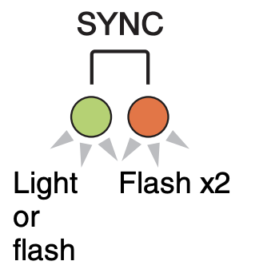        |An abnotmality has occurred on the circuit connected to the SECONDARY connector during redundant network operation|Check the circuit connected to SECONDARY connector             |

## Information Messages
*If the orange SYNC indicator is unlit, the unit is operating normally. If the green SYNC indicator is unlit, the unit's clock is unconfirmed*
|SYSTEM Indicators|Description                                                   |Possible Solution                                                                                                                              |
|-----------------|--------------------------------------------------------------|-----------------------------------------------------------------------------------------------------------------------------------------------|
|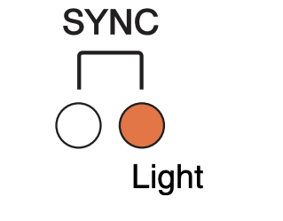           |Synchronizing on a Dante network                              |Please wait until started has completed or until the unit has finished synchronizaation. It may take up to 45 seconds for completion           |
|           |Waiting to receive setting data                               |If START UP MODE is set to REFRESH on the R-series unit, the input/output will be muted until the unit receives setting data after it starts up|
|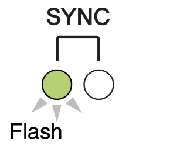           |The unit is functioning correctly and is the word clock leader|The unit is operating as the word clock leader                                                                                                 |
|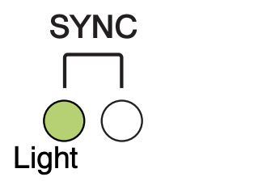           |The unit is functioning correctly as the word clock follower  |The unit is operating as the clock follower and the clock is synchronized                                                                      |

## Initializing the Rio
**to return (initialize) the internal memory to its factory-set state**
1. Turn the unit off
2. On the front panel, set DIP switch 5 & 6 down (on) and the rest of the DIP switches up (off)
3. Turn the unit on
	* during initialization, the [SYSTEM] and [SYNC] indicators remain turned off. when initialization is complete, each indicator lights up
4. Verify that initialization is completed, and turn the unit off
5. Set DIP switches for desired use settings
6. Turn the unit on

