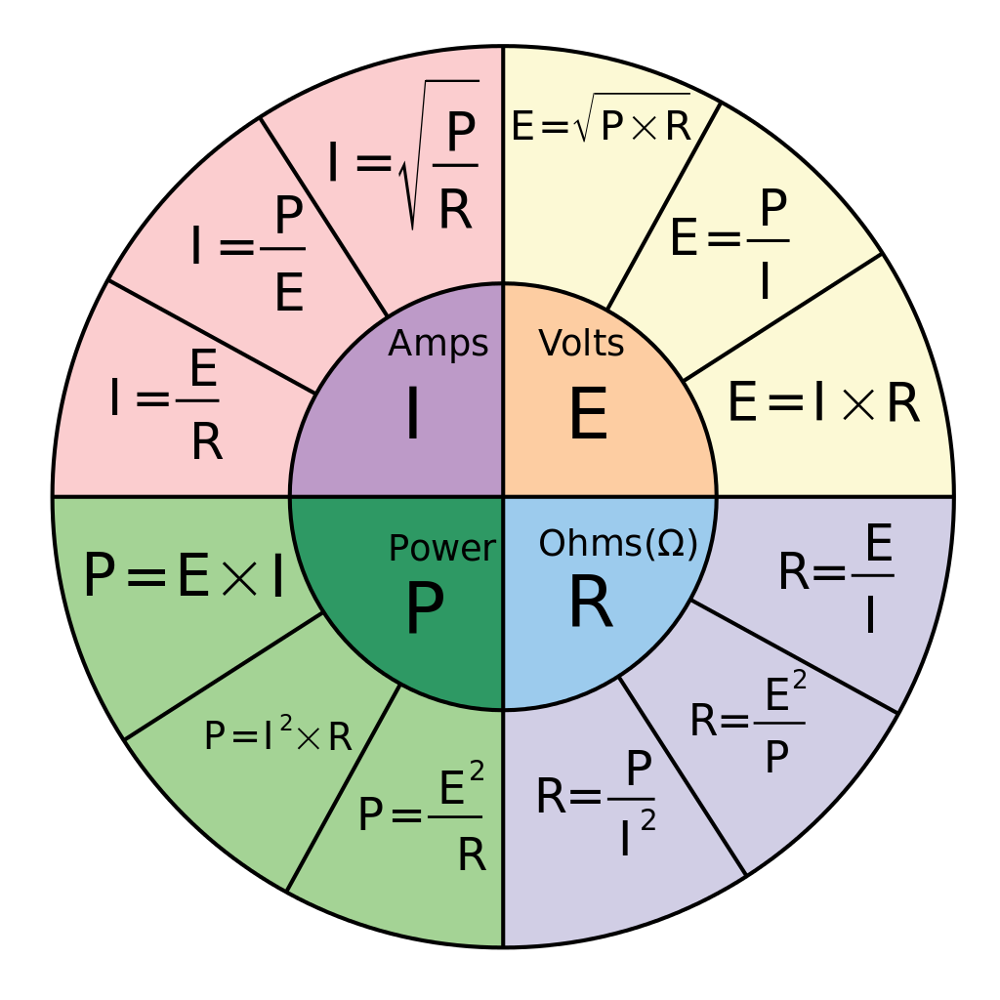

# Sound Maths

## Ohm's Law

### Helpful Sound Uses
* Mains AC Current Draw
    * I = P/E
    * 8.3A = 1000W / 120V
* Speaker Power Draw
    * P = E^2 / R
    * 100W = 28.3^2 / 8 ohms

## parallel speaker impedance
* 1/((1/z) + (1/z) + (1/n))
    * ex. 3 @ 8 ohm speakers
    * 1/((1/8)+(1/8)+(1/8))
    * 1/(3/8)
    * 2.666 ohms
